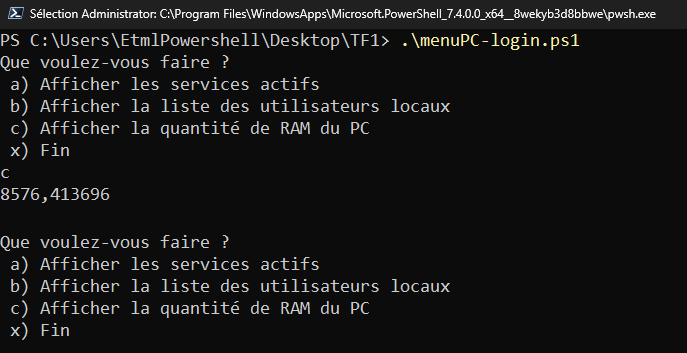

# pwsh-systemInfo
  

# Overview
The ```systemInfo.ps1``` script is designed to provide users with a menu offering various actions within a PowerShell environment. Users can choose to display active services, list local users, check the PC's RAM quantity, or exit the program.

# Script Information
- File Name: systemInfo.ps1
- Prerequisites: PowerShell 7.4.0
- Script Version: 1.0
- Author: Velickovic Mateja
- Creation Date: 08.12.2023
- Location: ETML, Sébeillon
- Changes: None

# Usage
To run the script, open a PowerShell terminal and execute the following command:
```.\systemInfo.ps1```

# Menu Options
1. Show Active Services (a):
Displays the names of active services on the system.

2. Show Local Users (b):
Lists the names of local users on the PC.

3. Show RAM Quantity (c):
Displays the total physical memory (RAM) of the PC in GiB.

4. Exit Program (x):
Exits the script.

# Examples

1. To display active services:<br>
Que voulez-vous faire ?<br>
 a) Afficher les services actifs<br>
 b) Afficher la liste des utilisateurs locaux<br>
 c) Afficher la quantité de RAM du PC<br>
 x) Fin<br>
PS> a<br>

2. To list local users:<br>
Que voulez-vous faire ?<br>
 a) Afficher les services actifs<br>
 b) Afficher la liste des utilisateurs locaux<br>
 c) Afficher la quantité de RAM du PC<br>
 x) Fin<br>
PS> b<br>

3. To display the RAM quantity:<br>
Que voulez-vous faire ?<br>
 a) Afficher les services actifs<br>
 b) Afficher la liste des utilisateurs locaux<br>
 c) Afficher la quantité de RAM du PC<br>
 x) Fin<br>
PS> c<br>

4. To exit the program:<br>
Que voulez-vous faire ?<br>
 a) Afficher les services actifs<br>
 b) Afficher la liste des utilisateurs locaux<br>
 c) Afficher la quantité de RAM du PC<br>
 x) Fin<br>
PS> x<br>

# Notes
- Ensure PowerShell version 7.4.0 is installed before running the script.
- The script is created by Velickovic Mateja at ETML, Sébeillon, with no reported changes.
- For any questions or issues, contact the script author.